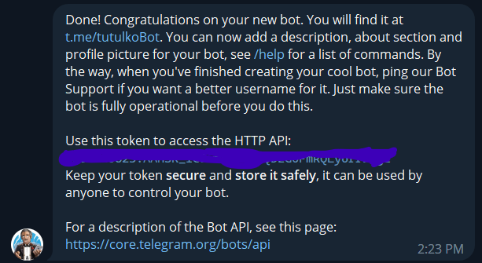
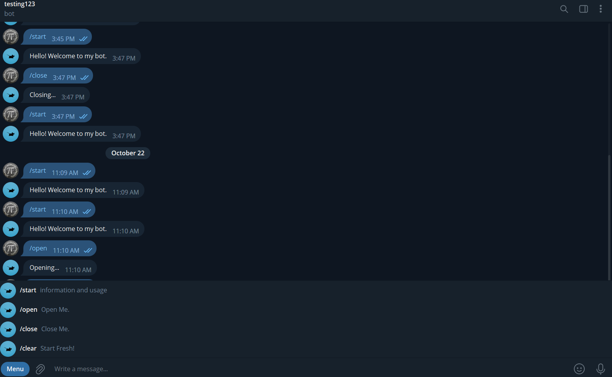

# A Telegram Bot for BOSC

This is a telegram bot for BOSC. It is built using node.js and package `node-telegram-bot-api`. It will have features like sending bulk messages to all or some the members of the group, notices and announcements from the BOSC team as well as from birendra multiple campus with the help of web scraping, and many more.

## First Time Contributing?

Go to `Contributing.md` file and follow the steps to make your first contribution to open source world.

Also be sure to first contribute to our [First Contributions](https://github.com/bosc-official/first-contributions) repository to get familiar with the open source world.

## How to run this project locally?

This project is built using React framework and vite.js is used as a bundler. So, you need to have node.js and react.js and vite.js installed in your system to run this project locally.

1. Clone this repository.
2. Run `npm install` to install all the dependencies.
3. Checkout `.env.example` file and create a `.env` file with the same content and fill the values of the variables. For example,
   ```plaintext
   TELEGRAM_BOT_TOKEN=your_bot_token
   PORT=your_port_number
   ```
4. Run `npm run dev` to start the development server.

## What to do?

There are many things to do in this project. You can choose any of the following tasks and start working on it. If you have any other ideas, you can also work on it. Just make sure to create an issue first and then start working on it.

- [ ] Add a feature to send bulk messages to all the members of the group.
- [ ] Add a feature to send notices and announcements from the BOSC team as well as from birendra multiple campus with the help of web scraping.
- [ ] Add a feature to send the latest news from the BOSC website or facebook page.
- [ ] Any other feature you can think of.

## How to generate a bot token?

1. Open telegram and search for `@BotFather`.
2. Send `/start` to start the bot.
3. Send `/newbot` to create a new bot.
4. Enter the name of the bot.
5. Enter the username of the bot.
6. Your token will be provided to you.
   

## Testing

For now, we need to deploy this app to test it. We will add a testing bot soon.

## Looks

The bot looks somethings like this and changes will be made as we progress.


## License

This project is licensed under the MIT License. See the [LICENSE](./LICENSE) file for details.
